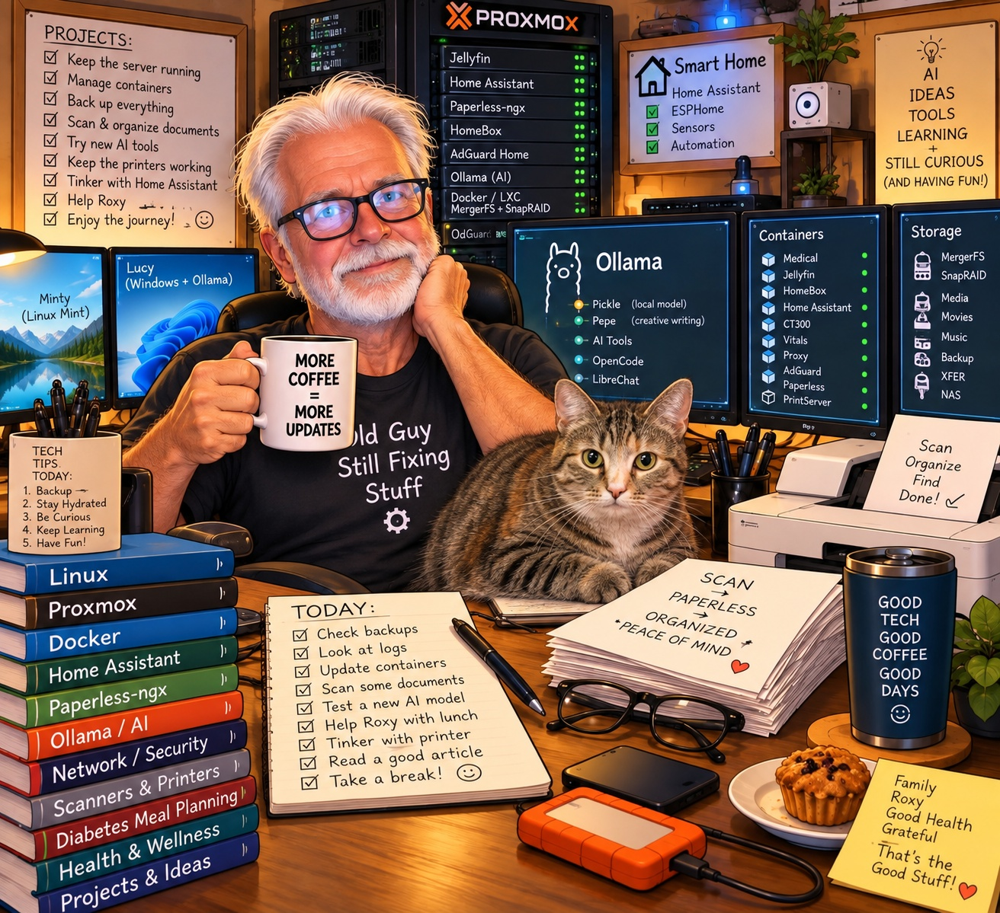

# The Human + AI Workshop

### A 75-year-old guy, a collection of old computers, an increasingly ridiculous home lab, and an AI assistant trying to build useful things.

Welcome to the workshop.

This is a record of what happens when curiosity, old computers, assorted
hardware, software experiments, and an AI assistant get thrown into the
same room.

There isn't a grand plan.

There are problems that need solving.

Sometimes we build an application.

Sometimes we write a tiny script that saves five minutes of irritation.

Sometimes we spend three hours discovering that the problem was one
line of configuration.

And sometimes an experiment produces a completely different idea.

That's what this journal is about.

## The Recent Adventures

### September 25, 2026

**[The Blood Glucose Meter](journal/the-blood-glucose-meter/)**

A little program that successfully retrieved a blood glucose reading
from a medical meter.

**[The Little Timestamp Program](journal/2026-09-25-the-timestamp-that-fixed-my-scanning-workflow.html)**

A tiny utility that generates timestamps for my scanning workflow and
puts them directly into the clipboard.

### September 26, 2026

**The ESP32 Medical Gateway**

The blood-meter experiment raised a larger question:

> Why should every computer have to know how to talk to every medical
> device?

That question led to the idea of using an ESP32 as a small,
device-independent gateway between Bluetooth medical equipment and the
computers that need the data.

And that's where the next adventure begins.

---

## What I'm Building

- **Medical Vitals Tracker**
- **Bluetooth Medical Device Tools**
- **ESP32 Medical Gateway**
- **Home Lab**
- **Ollama / Local AI**
- **Scanning and Paperless**
- **Various Small Things That Make Life Easier**

---

## The Rule

The finished program isn't the whole story.

The mistakes are part of the story.

The dead ends are part of the story.

The little victories are part of the story.

**This is what I tried.**

**This is what happened.**

**This is what we built.**
